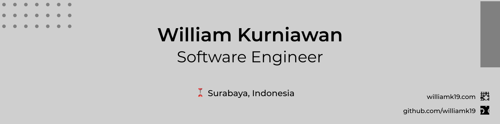

<!--  -->
## williamk19 ~ William Kurniawan
### Currently a Software Engineering Student and Web Developer
<!--
**william-nod/william-nod** is a ✨ _special_ ✨ repository because its `README.md` (this file) appears on your GitHub profile.
-->

- 🌱 I’m currently learning React, node.js, and laravel.
- 👯 I’m looking to collaborate on open source project.
- 🚲 Hobby : Sports and Reading.

### Language and Tools :

### Contact Me :
<a href="https://www.instagram.com/williamk19/">
<a href="https://www.linkedin.com/in/williamk19/">

<a href="mailto:williamkurniawan1144@gmail.com">

